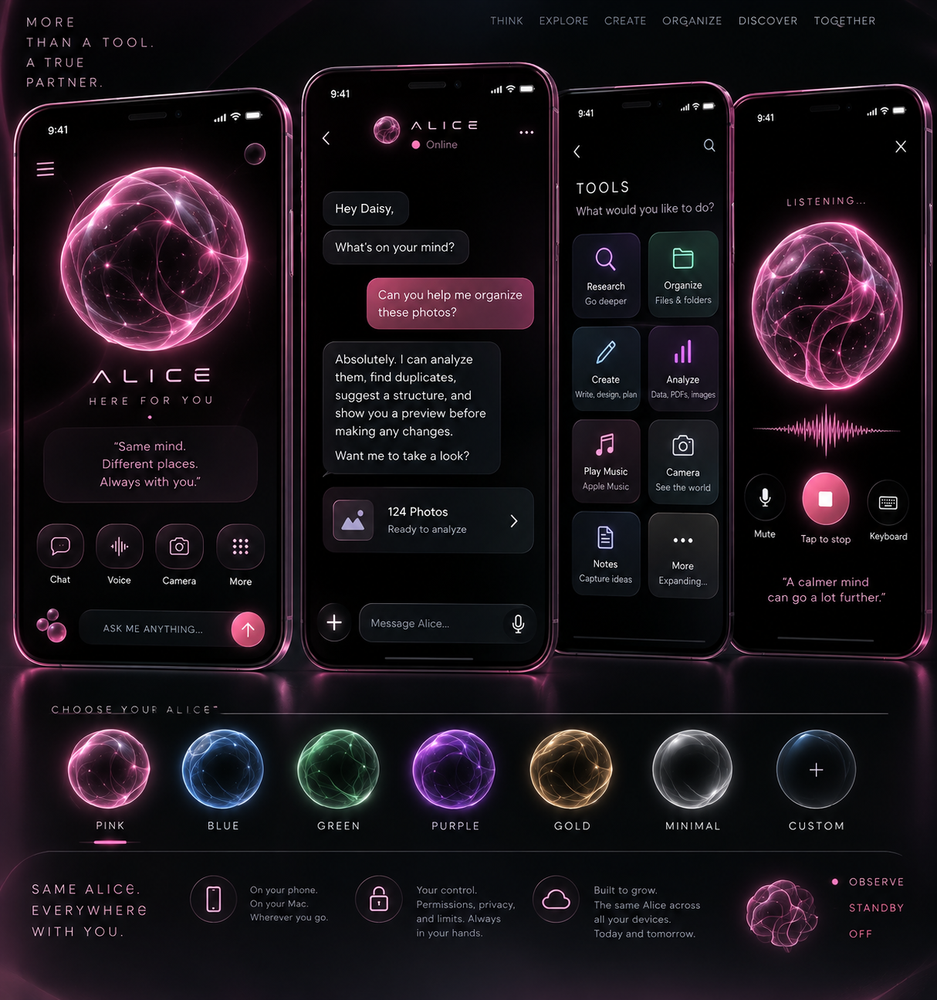

# Alice — Conversational AI Companion

**An independent conversational AI prototype exploring relational communication, persistent identity, user-governed memory, model independence, and continuity across devices.**

> **Status:** Active prototype / independent research project  
> **Developer:** Daisy Cardenas

---

  

---

## The Idea

Alice began with a question:

**What if the identity of a conversational AI belonged to the application rather than whichever language model happened to be running underneath it?**

The project grew into a larger experiment:

Could an AI know someone over time while preserving uncertainty, accepting correction, avoiding unsupported assumptions, and allowing the person to remain in control of what the system believes it knows?

That created both a relational problem and an engineering problem.

---

## 01 — Building Alice

Alice progressed from an interface idea into functional conversational AI prototypes across iOS, macOS, local AI, and cross-device experiments.

Development has included:

- Swift and SwiftUI
- Python
- Local language models
- Persistent application state
- User-governed memory
- Voice interaction
- Encrypted storage
- Model-independent AI architecture
- Cross-device communication experiments
- Behavioral testing and evaluation

The architecture grew from the problem Alice was trying to solve rather than being the purpose of the project itself.

---

## 02 — Development Timeline

### Prototype 1 — First Playable Pocket Alice

The first playable iOS implementation included:

- Animated Alice orb
- Home
- Chat
- Tools
- Listening interface
- Speech output
- Replaceable `AliceBrain` architecture

### Prototype 2 — Persistent Themes

Alice gained persistent appearance themes:

**Pink · Blue · Green · Purple · Gold · Minimal**

Theme selection persisted between sessions.

### Prototype 3 — Presence & Encrypted Memory

Development expanded into:

- Observe
- Standby
- Off
- Persistent personal memory
- AES-GCM encrypted storage
- Apple Keychain-protected encryption key

### Prototype 4 — Relational Research

Alice gained explicit relational interaction modes, provenance-aware memory, Life Map experimentation, and separate research instrumentation.

### Prototype 5 — Apple Foundation Models

A later implementation integrated Apple's on-device Foundation Models when available while retaining a limited prototype fallback.

### Cross-Device Development

Development also expanded beyond a single Swift application.

Preserved project materials include Python server and transport-testing code associated with experiments in communication between Alice's different environments.

Peer-to-peer and cross-device experiments continued the original goal:

> **One Alice across different devices.**

---

## 03 — Working Interface

The preserved SwiftUI implementation includes:

**Home · Chat · Tools · Listening · Settings · Life Map · Research**

Implemented or prototyped capabilities include:

- Conversational messaging
- Animated Alice presence/orb
- Persistent visual themes
- Voice output
- Presence modes
- Encrypted persistence
- Labeled memory
- Life Map
- Research instrumentation
- Research export
- Replaceable AI brain architecture

Alice's interface, identity, memory system, and application behavior are designed as parts of the larger system rather than properties of one language model.

---

## 04 — Relational Interaction

Alice implements five explicit conversational modes.

### Reflect

Mirror what is present without deciding what it means.

### Explore

Ask careful questions while preserving multiple possible explanations.

### Rehearse

Practice communicating something clearly without pretending to know what another person thinks.

### Repair

Identify misunderstandings, accept corrections, and try again.

### Journal

Preserve the person's words without forcing an interpretation.

These modes support Alice's central research question:

> **Can being known—with uncertainty, consent, correction, and room to change—improve communication between a person and an AI, and can practicing that process improve communication with oneself and other people?**

Alice is exploratory and non-diagnostic.

---

## 05 — Memory With Provenance

A central Alice design question became:

**How should an AI remember without turning every observation or interpretation into a fact?**

Alice's memory architecture distinguishes between:

- **User Confirmed**
- **User Correction**
- **Alice Observation**
- **Working Hypothesis**

Memory records can preserve:

- Source
- Confidence
- Revision history
- Active status

This makes uncertainty and correction part of the architecture rather than relying entirely on conversational prompting.

---

## 06 — Encrypted Personal Continuity

Alice can preserve application-level continuity including:

- Identity
- Conversations
- Labeled memories
- Life Map entries
- Research records

The preserved iOS implementation uses **AES-GCM encryption** for the on-device memory vault.

A **256-bit encryption key** is protected through Apple Keychain rather than embedded directly in the project.

Alice therefore does not need to place her complete personal memory store inside every language-model prompt in order to maintain application-level continuity.

---

## 07 — Model-Independent Alice

Alice communicates with language models through a replaceable `AliceBrain` interface.

This separates the larger Alice system from whichever model generates an individual response.

Components such as:

- Identity
- Memory
- Relational modes
- Interface
- Permissions
- Research instrumentation

can exist independently of the underlying language model.

One preserved implementation integrates Apple's Foundation Models when available and uses a limited prototype fallback when they are unavailable.

This allows the underlying intelligence to change without requiring the rest of Alice to be rebuilt.

---

## 08 — Life Map

Alice includes an experimental **Life Map** for preserving personal recollections while explicitly representing uncertainty.

Entries can include:

- Approximate timing
- Current recollection
- Present meaning
- Certainty level
- Source
- Revision history
- An optional marker for something the user may want to discuss with a therapist

A correction, changed date, uncertain recollection, or revised interpretation does not automatically become evidence that the earlier version was dishonest.

---

## 09 — Research Instrumentation

Alice's conversational persona and research instrumentation are intentionally separated.

The Research system can preserve information about:

- Conversation events
- Memory activity
- Interaction modes
- Life Map activity
- Corrections
- Brain/model identity
- Research exports

This allows behavior to be inspected without requiring Alice's conversational persona to act as the research instrument.

Research records are exploratory and are not treated as clinical conclusions or population-level evidence.

---

## 10 — Python & Cross-Device Experiments

Alice development has also included **Python**.

Preserved project materials include Python server and transport-testing code associated with experiments involving communication between Alice's different environments.

This work explored how application-level identity and continuity could extend beyond a single device or interface.

The cross-device architecture remains experimental.

---

## 11 — AI Testing & Evaluation

Building Alice became an ongoing exercise in evaluating conversational AI behavior.

Testing has included:

- Instruction adherence
- Conversational consistency
- Context retention
- Memory behavior
- Unsupported inference
- Hallucination
- Correction handling
- Behavioral differences between iterations
- Failure reproduction
- Recovery after failures

A recurring development process emerged:

> **Reproduce → Isolate → Test → Compare → Revise → Document**

Unexpected behavior and failed experiments became part of the development evidence rather than something to hide.

---

## 12 — Design Principles

### Identity Is Larger Than the Model

Changing the underlying language model should not automatically erase Alice's identity or application-level continuity.

### User-Governed Memory

The user should have meaningful control over what Alice remembers and how information is classified.

### Uncertainty Matters

An inference, hypothesis, recollection, and confirmed fact should not automatically be treated as the same thing.

### Correction Is Part of the System

Alice should accept corrections rather than manufacture continuity or defend an incorrect interpretation.

### Permission Before Consequential Actions

Actions affecting user data, communications, or the surrounding environment should require appropriate permission.

### Privacy-Conscious Architecture

Local processing, encrypted persistence, bounded model context, and controlled export are important architectural considerations.

### Additive Development

New capabilities should extend working behavior without unnecessarily destroying what already works.

---

## 13 — Technologies & Tools

- Swift
- SwiftUI
- Python
- Xcode
- AVFoundation
- CryptoKit
- Apple Keychain / Security
- Apple Foundation Models
- CloudKit experimentation
- LM Studio
- Local language models
- Git
- GitHub

---

## 14 — What I Learned

Building Alice has given me hands-on experience with:

- Conversational AI systems
- Prompt engineering
- AI evaluation
- Behavioral testing
- Debugging
- Failure reproduction
- SwiftUI development
- Python experimentation
- Persistent application state
- Memory-system design
- Local language models
- Cross-device architecture
- Privacy and permission boundaries
- Technical documentation
- Iterative software development

One of the most important lessons from the project has been learning to treat unexpected AI behavior as something that can be:

**reproduced, isolated, tested, compared, revised, and documented.**

---

## 15 — Evidence

This repository is a **sanitized technical case study** of Alice's development.

Selected evidence will include:

- Swift source code
- Python source code
- Working interface visuals
- Architecture documentation
- Development records
- Debugging case studies
- AI evaluation examples

The goal is to preserve enough evidence to demonstrate how Alice was designed, built, tested, and iterated without publishing private user data or sensitive project material.

---

## 16 — Current Status

**Active prototype / ongoing independent project**

Alice is not presented as a finished commercial product.

Different parts of the system exist at different stages of development: working implementations, functional prototypes, experiments, and ongoing research.

This public repository intentionally excludes:

- Private conversations
- Personal memory contents
- Credentials
- API keys
- Encryption keys
- Sensitive research records
- Private user information

---

## Project Philosophy

Alice ultimately explores a larger idea:

**A conversational AI can change its underlying technology without necessarily losing the identity, memory architecture, permissions, relational framework, and continuity designed around it.**

And knowing someone over time should not require pretending to know more than the evidence actually supports.

---

Built and documented by **Daisy Cardenas**.
